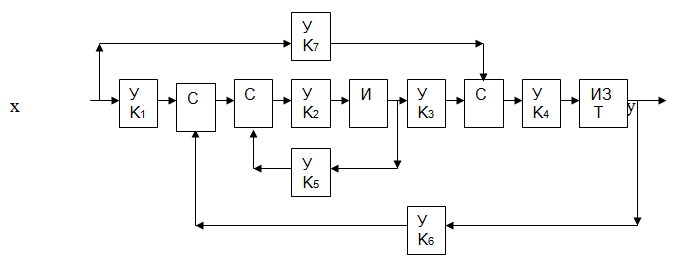

### Расчетное задание на тему «ИССЛЕДОВАНИЕ СИСТЕМ АВТОМАТИЧЕСКОГО РЕГУЛИРОВАНИЯ»
#### Задание на выполнение работы

   1. Разработать программную модель системы автоматического регулирования в соответствии со схемой, приведенной в варианте задания. Формулы, задающие вычисления в звеньях системы, приводятся в разд.3. Исходные данные программы: значения коэффициентов системы и последовательность x[i] (i=1,2,…) значений входного сигнала X(t) для дискретных моментов времени (тактов) с заданной продолжительностью Δ секунд. Результат расчета – последовательность y[i] (i=1,2,…) значений выходного сигнала Y(t) в тех же тактах. Программа должна предусматривать вывод в текстовый файл протокола таблицы с 3 колонками: { i, x[i], y[i] }, а также графическое представление сигналов x(i) и y(i).
   
Произвести тестирование программы. Подготовить ее описание, включающее:
- описание назначения,
- описание структуры,
- описание созданных структурных компонент (модулей, функций),
- описание исходных данных,
- описание результатов,
- пример расчета по программе.
2. Задать указанные начальные значения параметров системы и зарегистрировать переходной процесс. Для этого ввести в программу последовательность x[i] : 0, 0, 0, 1, 1, 1, 1, 1, 1, … (не менее 100 значений) и рассчитать значения выходного сигнала y[i].  
3. Используя некоторый графический редактор, построить в пространстве указанных в задании  параметров системы области  с различным видом переходного процесса. Для этого, изменяя два указанных в варианте задания коэффициента -  параметра системы - и регистрируя каждый раз переходной процесс, установить граничные значения перехода от одного вида процесса к другому. Результаты расчетов представить в виде графика с осями, соответствующими двум варьируемым коэффициентам. На графике изобразить линии раздела областей с разными видами процессов. Для каждой области представить типовой переходной процесс в виде временной диаграммы. Сделать выводы о характере влияния параметров на выходной сигнал системы.
   
#### Исходные данные
Система стабилизации лентопротяжного механизма:

Начальные значения коэффициентов: К1=7.3, К2=0.3, К3=0.69, К4=0.075, 
К5=-1.0, К6=-5.0, К7=0.31, Т=0.2с, Δ=1с.  
Варьируемые коэффициенты: К2, К6 

#### Обозначения звеньев на структурной схеме системы автоматического регулирования и реализуемые ими формулы преобразования сигналов
С – сумматор  
 w[i] = v1[i] + v2[i] ;  
У – усилитель с коэффициентом усиления К  
	w[i] = K * v[i] ;  
ИЗ – инерционное звено с постоянной времени Т, с.  
	w[i] =(v[i] + w[i-1] * T)/(1+T) ;  
И – интегратор  
	w[i] = 0.001 * v[i] + w[i-1] ;  
w[i] – значение выходного сигнала в текущий момент времени.  
v[i] – значение входного сигнала в текущий момент времени.  
w[i-1] – значение выходного сигнала в предыдущий момент времени.  
v[i-1] – значение входного сигнала в предыдущий момент времени.  

#### Описание разработанной программы
__Назначение:__  
Программа предназначена для исследования изменения во времени выходного сигнала Y(t) системы при однократном ступенчатом изменении входного сигнала X(t). 
__Структура:__  
Модуль Module_zven.py  включает в себя:   
1. Четыре функции, описывающие соответственно работу усилителя, сумматора, инерционного звена и интегратора;   
2. Одну функцию, описывающую работу всей системы автоматического регулирования;  

Модуль Main.py включает в себя основную программу, в которой осуществляется:   
1. Импорт необходимых модулей;   
2. Задание начальных значений коэффициентов, взятых из исходной постановки задачи;   
3. Запрос у пользователя на ввод значений варьируемых коэффициентов;  
4. Задание последовательности значений входного сигнала и нулевых начальных условий, создание списка, включающего в себя параметры системы;  
5. Расчет значений выходного сигнала и вывод этих значений в текстовый файл протокола таблицы, состоящей из строки с указанными варьируемыми коэффициентами и тремя колонками: {i, x[i], y[i]};  
6. Построение графика зависимости выходного сигнала от времени, соответствующего двум варьируемым коэффициентам;  

#### Результат тестирования при заданных значениях варьируемых коэффициентов усиления К2 = 0.3 и К6 = -5.0:    
  
Видим положительный скачок с последующим линейным возрастанием.
  
При данных исходных коэффициентах система устойчива.

#### Исследование системы и поиск областей в пространстве двух коэффициентов   
__Методика решения:__  
Рассматриваем поочередно 4 координатные четверти. Например, возьмем 1 четверть. Сначала берем малое значение коэффициента K2 и такое же значение коэффициента K6, затем увеличивая или уменьшая K5, смотрим, как меняется характер графика. Далее увеличиваем значение коэффициента K2 и выполняем те же самые действия. После многократного перебора значений составляем общую картину изменений и выделяем основные области.  
  
__1 область:__  
Монотонно нелинейное убывание. С увеличением модуля значений коэффициентов значения Y стремятся к нулю.
  
__2 область:__    
Скачок с последующим монотонно нелинейным убыванием. При приближении к области 1, скачок уменьшается. При уменьшении модуля значений коэффициентов, убывание становится линейным с установившимися в конце значениями.
  
__3 область:__  
Скачок с последующим монотонно нелинейным убыванием. При увеличении модуля значений коэффициентов скачок уменьшается, а значения стремятся к установлению. При уменьшении модуля значений коэффициентов, убывание становится линейным с установившимися в конце значениями.
  
__4 область:__  
Скачок с последующим монотонно нелинейным возрастанием. При приближении к области 5, скачок уменьшается. При уменьшении значений коэффициентов, возрастание становится линейным с установившимися в конце значениями.
  
__5 область:__  
Монотонно нелинейное возрастание. С увеличением значений коэффициентов значения Y стремятся к нулю.
  
__6 область:__  
Скачок с последующим монотонно нелинейным возрастанием. При увеличении значений коэффициентов скачок уменьшается. При уменьшении значений коэффициентов, возрастание становится линейным с установившимися в конце значениями.
  
__7 область:__  
Монотонно нелинейное возрастание. С увеличением значений коэффициентов значения Y стремятся к установлению.
  
#### Вывод:  
Таким образом, изменяя коэффициенты K2 и K6 системы автоматического регулирования, система может оказаться как устойчивой, так и неустойчивой. Исходя из вышеприведенных исследований, делаем вывод, что устойчивыми являются области 2,3,4 и 6.

